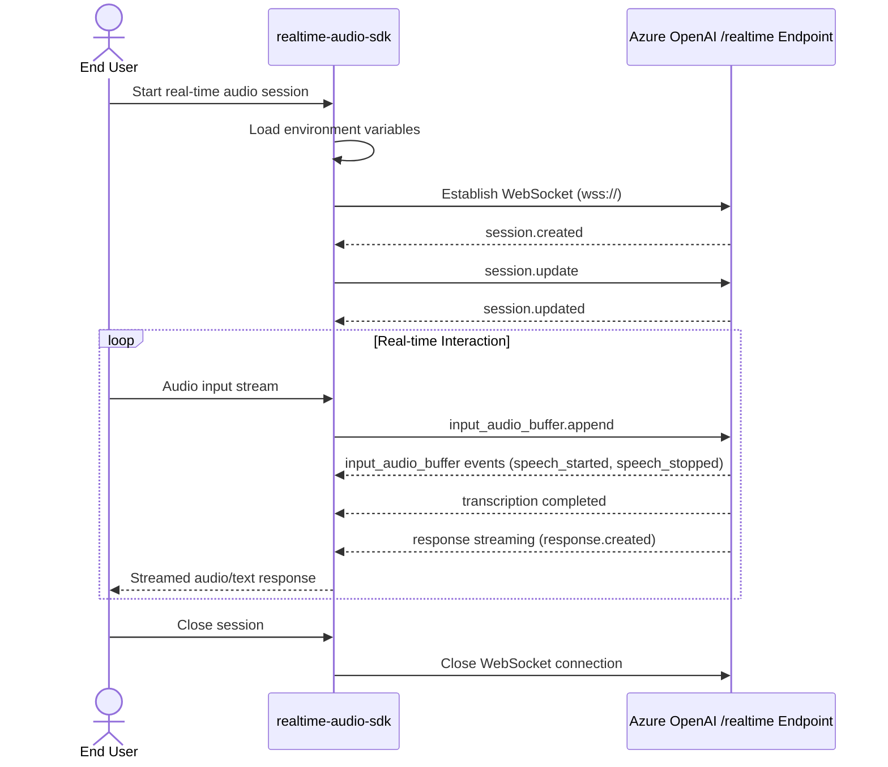

# Realtime Audio SDK

## Introduction

The `realtime-audio-sdk` provides a robust framework for building real-time audio-based conversational applications. It includes two primary interaction modes:

- **Low-Level Client** (`low_level_sample.py`): Directly interacts with Azure OpenAI's realtime WebSocket API, giving fine-grained control.

- **RTClient (coming in v0.1.2)**: A higher-level abstraction to streamline SDK usage, reducing complexity for common use cases.

---

## Repository Structure

- `rtclient/`: Core SDK code including low-level client implementation.
- `samples/`: Example scripts demonstrating SDK usage (`low_level_sample.py`).
- `test_data/`: Sample audio files for testing.
- `.env` file template (`development.env`) for environment variables.

---

## Getting Started

### Prerequisites

- Python `3.10` or later.

### Step 1: Create and Activate a Virtual Environment

```bash
python3 -m venv venv
source venv/bin/activate
```

### Step 2: Install Dependencies

You can install dependencies via two methods:

#### Method A: Using `requirements.txt`

```bash
pip install -r requirements.txt
```

#### Method B: Using Poetry

```bash
poetry install
```

### Step 3: Download and Install SDK Wheel (Optional)

You can optionally download the latest pre-built wheel directly from GitHub:

- For **bash** users:
  ```bash
  ./download-wheel.sh
  pip install rtclient-0.5.1-py3-none-any.whl
  ```

- For **PowerShell** users:
  ```powershell
  pwsh ./download-wheel.ps1
  pip install rtclient-0.5.1-py3-none-any.whl
  ```

> **Note:** Ensure `jq` is installed when using the bash script.

### Step 4: Set Up Environment Variables

## ⚙️ Configure Environment Variables

Copy provided `development.env` as your `.env` file and update values:

```bash
cp development.env .env
```

Example `.env`:
```env
AZURE_OPENAI_ENDPOINT=<your_endpoint>
AZURE_OPENAI_API_KEY=<your_key>
AZURE_OPENAI_DEPLOYMENT=gpt-4o-realtime-preview
OPENAI_API_KEY=<your_openai_key>
OPENAI_MODEL=gpt-4o-realtime-preview-2024-12-17
```

If `.env` fails, set manually:
```bash
export AZURE_OPENAI_ENDPOINT=<endpoint>
export AZURE_OPENAI_API_KEY=<key>
# etc...
```

---

## Running the Samples

- To run the **Low-Level Client Sample**:

```bash
python samples/low_level_sample.py samples/input/sample.wav <azure|openai>
```

- `<azure|openai>`: Choose `azure` or `openai` depending on the API endpoint.
- Sample audio files in multiple formats (`.wav`, `.ogg`, `.flac`, `.mp3`) are included under `samples/input/`.

---
## SDK Interaction Flow



---

## FAQs and Troubleshooting

### Q: Which Python version should I use?
- Use Python `3.10` or later.

### Q: Error `ModuleNotFoundError: rtclient`
- Run:
```bash
pip install -e .
# or using poetry
poetry install
```

### Q: `.env` file variables are not loading?
- Manually export variables in terminal if `.env` fails.

### Q: WebSocket connection fails?
- Check your Azure credentials and endpoint URL.

---

## What's Coming in v0.1.2:

- Integration of **RTClient**, a simplified higher-level abstraction.
- Robust error handling, logging, and retry mechanisms.
- Expanded documentation and additional comprehensive sample scenarios.

## Roadmap

### Currently Functional (Version 0.1.1)

- Low-Level client (`RTLowLevelClient`) functionality
- Sample audio streaming scripts (`low_level_sample.py`)
- Basic environment variable setup
- Initial support for both Azure OpenAI and standard OpenAI endpoints

### Coming Soon (Version 0.1.2)

- Higher-Level client (`RTClient`) abstraction
- Improved error handling and logging
- Comprehensive test suite and CI/CD pipeline
- Expanded documentation and usage examples
- Enhanced sample scripts (VAD/Non-VAD examples)

---

## Notes

- Ensure all required environment variables in `.env` are set before running any samples.
- Feedback and contributions are welcome as we continue to evolve the SDK.

