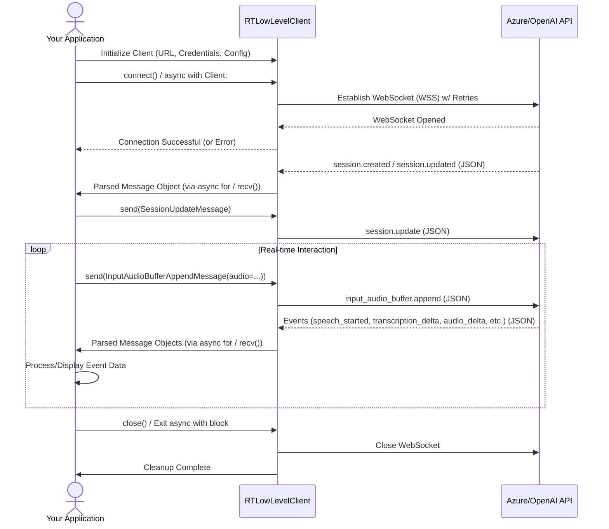

# GenAI Realtime Audio SDK

## Introduction

The `realtime-audio-sdk` provides a foundational framework for building real-time audio-based conversational applications using Azure OpenAI and standard OpenAI APIs.

Currently, the SDK includes:

-   **`RTLowLevelClient`**: A **robust low-level client** implementation (`rtclient/low_level_client.py`) that directly interacts with the underlying real-time WebSocket API. It incorporates production-readiness features like automatic connection retries, reconnection logic, state management, improved error handling, and logging.
-   **Low-Level Sample** (`samples/low_level_sample.py`): Demonstrates usage patterns and event handling with the `RTLowLevelClient`.

A higher-level `RTClient` abstraction is planned to streamline SDK usage further for common use cases (see Roadmap).

---

## Repository Structure

-   `rtclient/`: Core SDK code including the `RTLowLevelClient`.
-   `samples/`: Example scripts demonstrating SDK usage.
    -   `input/`: Sample audio files (`.wav`, `.ogg`, `.flac`, `.mp3`).
-   `tests/`: Unit and integration tests for the SDK.
-   `development.env`: Template for environment variables.
-   `pyproject.toml`: Project definition and dependencies for Poetry.

---

## Getting Started

### Prerequisites

-   Python `3.10` or later.
-   [Poetry](https://python-poetry.org/docs/#installation) for dependency management.

### Step 1: Create and Activate a Virtual Environment

It's highly recommended to use a virtual environment. Poetry manages this automatically, but you can also create one manually if preferred:

```bash
  # Optional: Create manually if not using Poetry's        environment management
  python3 -m venv .venv
  source .venv/bin/activate
```
If using Poetry, it will typically create and manage the environment for you. You can activate its shell via:
```bash
  poetry shell
```
### Step 2: Install Dependencies

The primary method for installing the SDK (for development) and its dependencies is using Poetry:

```bash
  # Installs main dependencies + development dependencies (like pytest)
  poetry install
```

This command reads the pyproject.toml and poetry.lock files to create a consistent environment with all necessary packages, including the rtclient itself in editable mode.

### Step 3: Set Up Environment Variables
Copy the provided template file and update it with your specific API credentials and configuration:

Open the .env file in your editor and fill in the required values.

```bash
# --- Azure OpenAI Configuration ---
AZURE_OPENAI_ENDPOINT="<your_azure_endpoint_url_e.g._[https://your-resource.openai.azure.com/](https://your-resource.openai.azure.com/)>"
AZURE_OPENAI_API_KEY="<your_azure_api_key>"
# Deployment name for the real-time capable model in Azure
AZURE_OPENAI_DEPLOYMENT="gpt-4o-realtime-preview"

# --- Standard OpenAI Configuration ---
OPENAI_API_KEY="<your_standard_openai_api_key>"
# Model name compatible with OpenAI's real-time API
OPENAI_MODEL="gpt-4o-realtime-preview-2024-12-17"

```


The sample scripts use python-dotenv to automatically load these variables from the .env file. If this fails for any reason, you can manually export the variables in your terminal session:


```bash
export AZURE_OPENAI_ENDPOINT="<your_azure_endpoint_url>"
export AZURE_OPENAI_API_KEY="<your_azure_api_key>"
# etc...

```

## Running the Samples

Ensure your virtual environment is activated and your .env file is correctly configured.

- To run the Low-Level Client Sample (from the project root directory):
  ```bash
  # Example using OpenAI
  python samples/low_level_sample.py samples/input/sample.wav openai

  # Example using Azure OpenAI
  python samples/low_level_sample.py samples/input/sample.wav azure
  ```
  - Replace samples/input/sample.wav with the path to your desired input audio file.
  - Specify openai or azure as the final argument to target the respective API endpoint configured in your .env file.

## SDK Interaction Flow (Low-Level)


---
## Current Features
The SDK currently provides the following core features:

## RTLowLevelClient:
- Robust low-level WebSocket client implementation.
- Support for both Azure OpenAI and standard OpenAI real-time API endpoints.
- Automatic Connection Retries: Handles transient network issues during initial connection (configurable).
- Automatic Reconnection: Attempts to re-establish connection if dropped during send/receive operations.
- State Management: Tracks client state (CONNECTING, CONNECTED, RECONNECTING, CLOSED, etc.).
- Improved Error Handling: Uses specific exceptions (ConnectionClosedException, InvalidMessageFormatError, etc.) for clearer error reporting.
- Integrated Logging: Uses standard Python logging for observability.
- Unit Tests: A comprehensive pytest suite validates the robustness and functionality of RTLowLevelClient using mocking.
- Sample Script (low_level_sample.py): Demonstrates a working end-to-end Voice-to-Text/Voice-to-Voice flow using the RTLowLevelClient, including handling various server message types.

## Roadmap / Next Steps

The following features and improvements are planned:

- High-Level RTClient: Development of a higher-level abstraction layer over RTLowLevelClient. This client will offer a simplified API (e.g., using callbacks/events instead of manual message parsing) for easier integration into applications.
- Configuration Management: Enhance configuration options, potentially loading settings from external files (e.g., YAML).
- Application Demos: Create specific demo applications using the RTClient:
  - Real-time transcription redaction.
  - Fraudulent call detection patterns.

- CI/CD Pipeline: Set up automated testing and build processes.

- Documentation: Expand API reference documentation and provide detailed usage guides, especially for the upcoming RTClient.

## FAQ / Troubleshooting
- Q: Which Python version should I use?
  
  Use Python 3.10 or later.
- Q: Error ModuleNotFoundError: No module named 'rtclient'

  Make sure you have activated the correct virtual environment (e.g., run poetry shell).
  Ensure you have installed the dependencies using poetry install in the project root directory. This installs rtclient in editable mode.
- Q: .env file variables are not loading?

  Ensure the .env file is in the same directory where you are running the Python script (or a parent directory).
  Verify the file is named exactly .env.
  As a fallback, manually export the variables in your terminal session before running the script.
- Q: WebSocket connection fails (e.g., Handshake errors, Authentication errors)?

  Double-check the AZURE_OPENAI_ENDPOINT / OPENAI_API_KEY / AZURE_OPENAI_API_KEY / AZURE_OPENAI_DEPLOYMENT / OPENAI_MODEL values in your .env file for typos or incorrect values.
  Ensure your API keys are valid and have permissions for the specified models/deployments.
  Check network connectivity and firewalls.
  Enable DEBUG logging (see client code or sample script) for more detailed error messages from the client.
## Notes
- Ensure all required environment variables in .env are set correctly before running samples.

This project is under active development. Feedback and contributions are welcome!